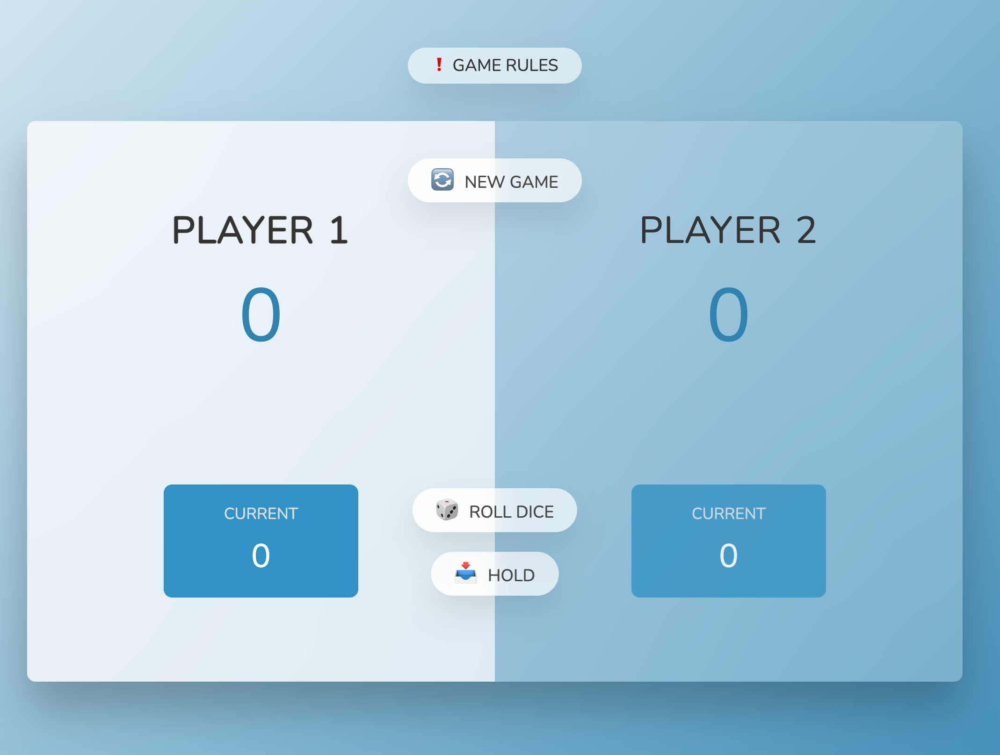
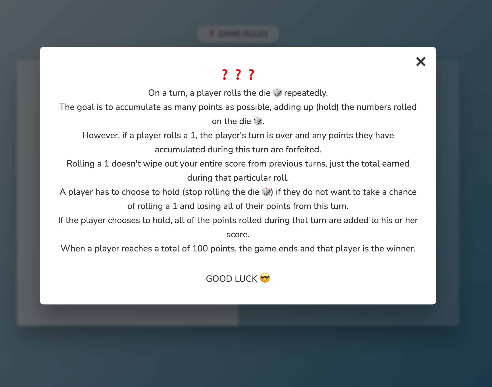
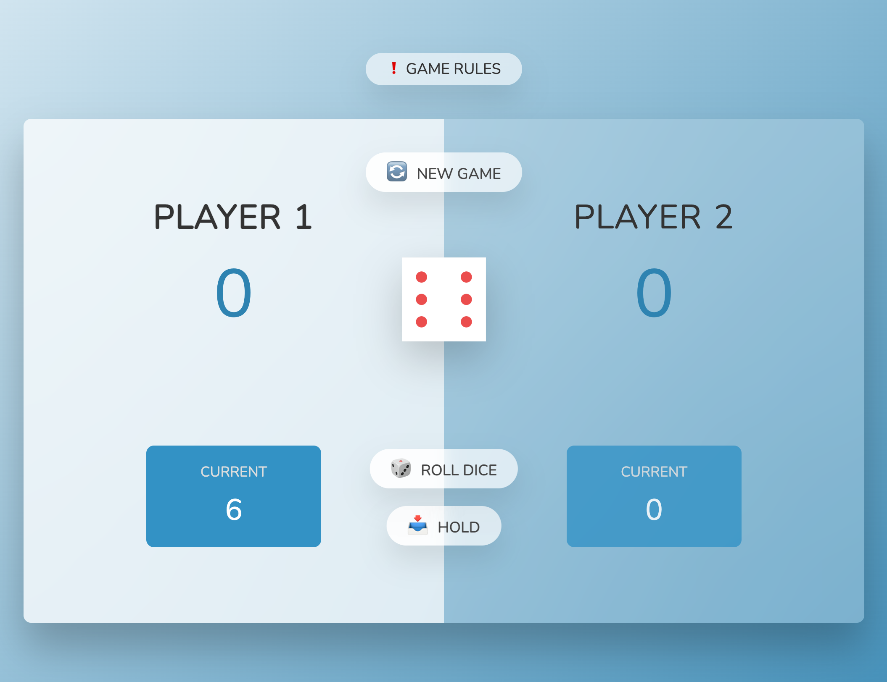
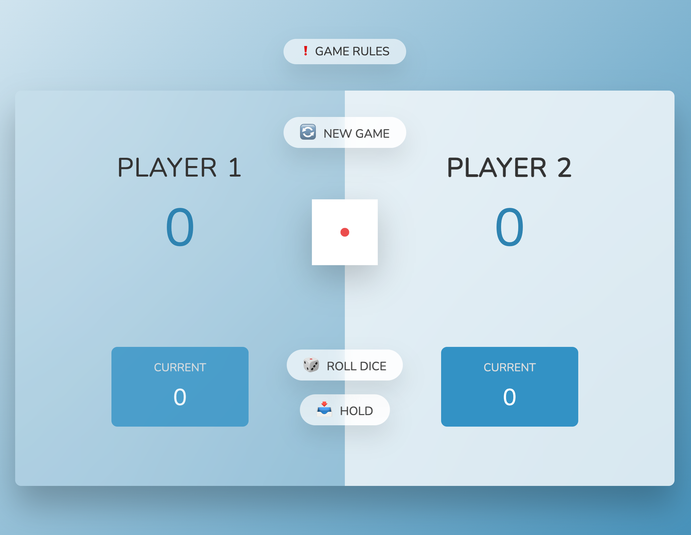
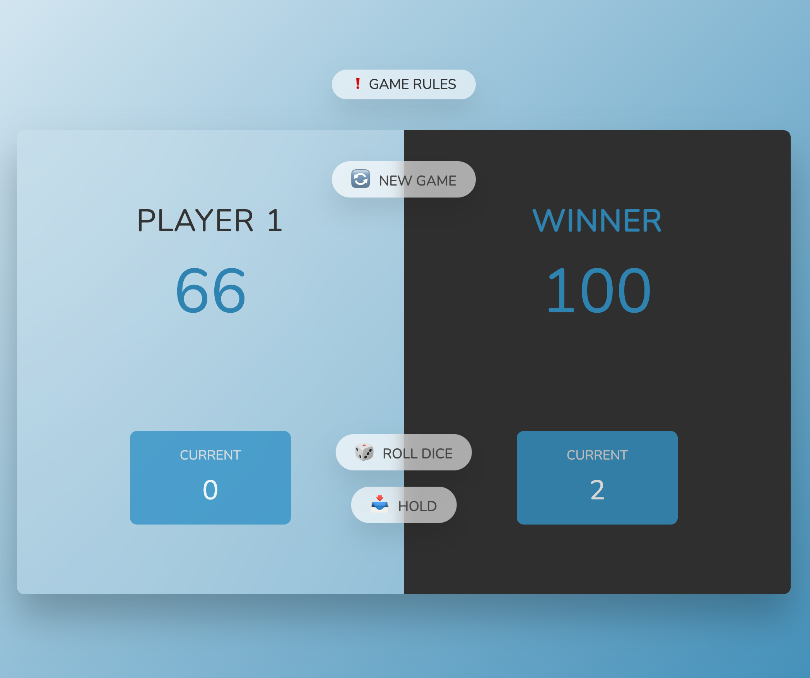

# Roll a Dice Game

## Introduction

Roll a dice game is a program used to roll a random numbers between 1 to 6 assigned by computer AI.

## Game Rule

On a turn, a player rolls the die 🎲 repeatedly.  The goal is to accumulate as many points as possible, adding up (hold) the numbers rolled on the die 🎲. However, if a player rolls a 1, the player's turn is over and any points they have accumulated during this turn are forfeited.
 Rolling a 1 doesn't wipe out your entire score from previous
turns, just the total earned during that particular roll.  A
player has to choose to hold (stop rolling the die 🎲) if they do not
want to take a chance of rolling a 1 and losing all of their points
from this turn.  If the player chooses to hold, all of the points
rolled during that turn are added to his or her score.  When a
player reaches a total of 100 points, the game ends and that player is
the winner.  

## Features

1. Using Css, html and Js to display friendly user interface and interact with players
2. Let user roll a random number
3. Let user enter hold score by clicking HOLD button
4. Save and calculate Score
5. The computer automatically assigns a random number
6. Create animation by changing color and text, switching between player
7. it is a responsive website so you can play the game on multiple devices

### You Can Try It Here: [Roll A Dice][1] 😎

[1]: https://roll-a-dice-vod6.netlify.app/'Roll A Dice'

## Getting Started

### Installation and setup

1. you need an IDE (VS Code, Pycharm, WebStorm, ...) that is compatible with HTML, CSS and Js to be able to run this code
2. Clone this repository and import it into your IDE

### Run

#### 1. You need to install live server to be able to run this code

You can find it here : https://marketplace.visualstudio.com/items?itemName=ritwickdey.LiveServer

After install live server, click to Go Live button

#### 2. Roll a dice by clicking the ROLL DICE button

#### 3. The screen will switch to another player if you get number 1 🤦

#### 4. Click HOLD button if you want to save your current score ✅

#### 5. Your highest score will be saved ✅

#### 6. When a player reaches a total of 100 points, the game ends and that player is the winner. 🥳

#### 8. Click NEW GAME button to play again

## Contributing

Pull requests are welcome. For major changes, please open an issue first to discuss what you would like to change.

Please make sure to update tests as appropriate.
